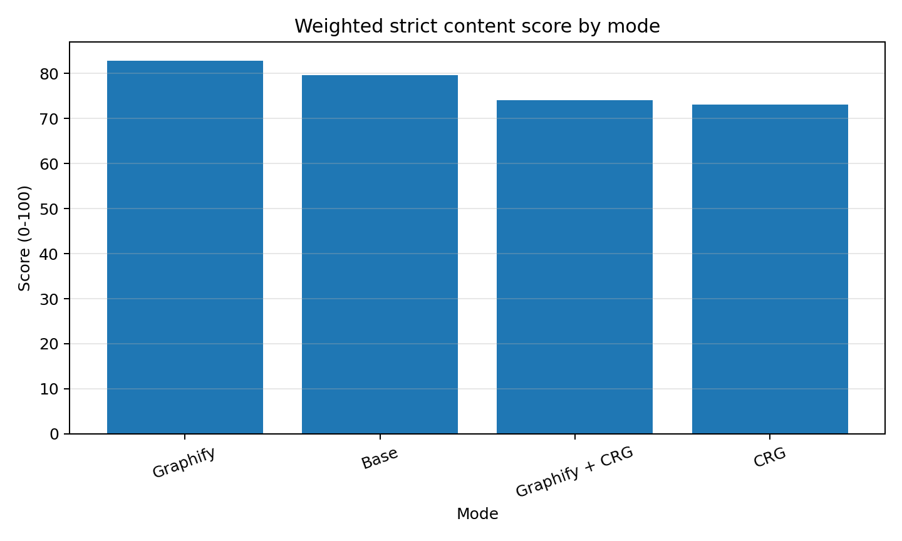
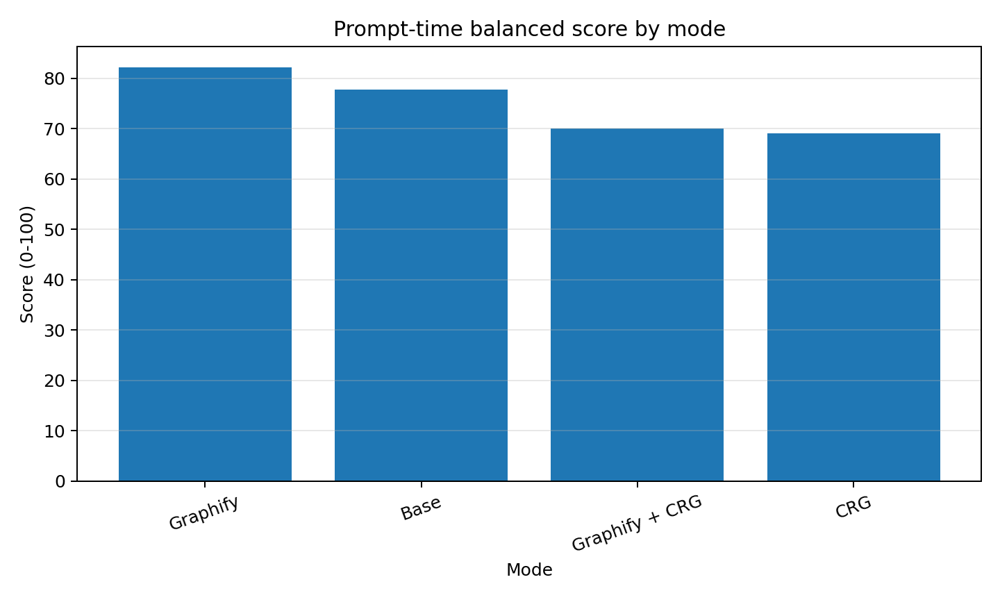
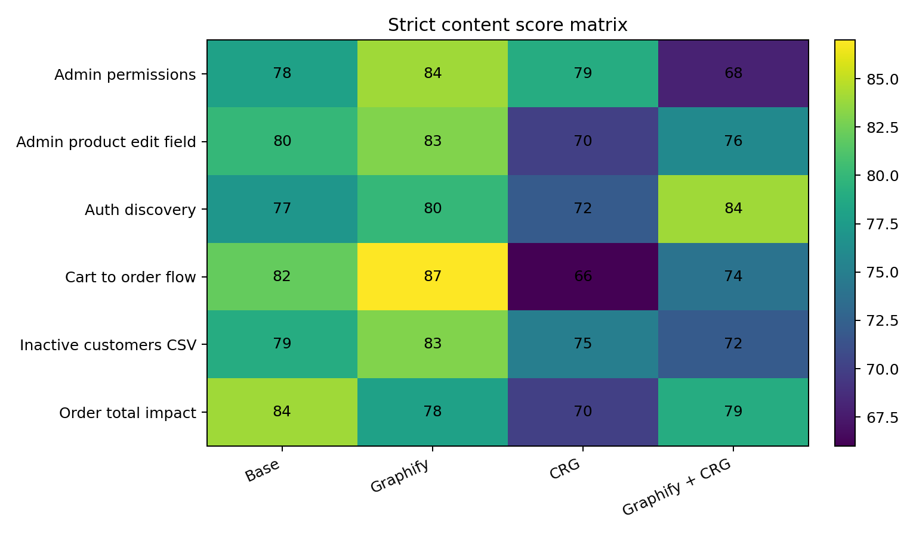
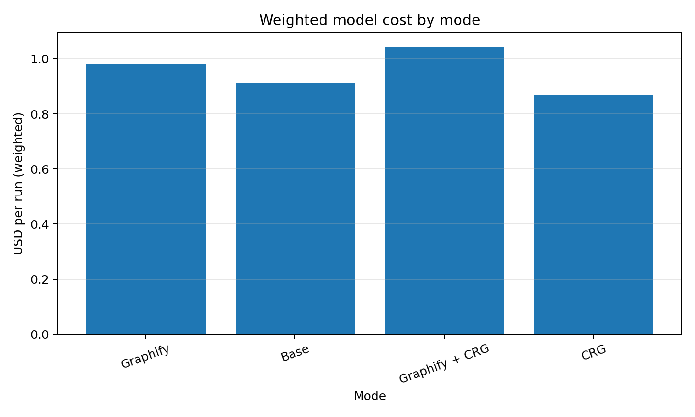
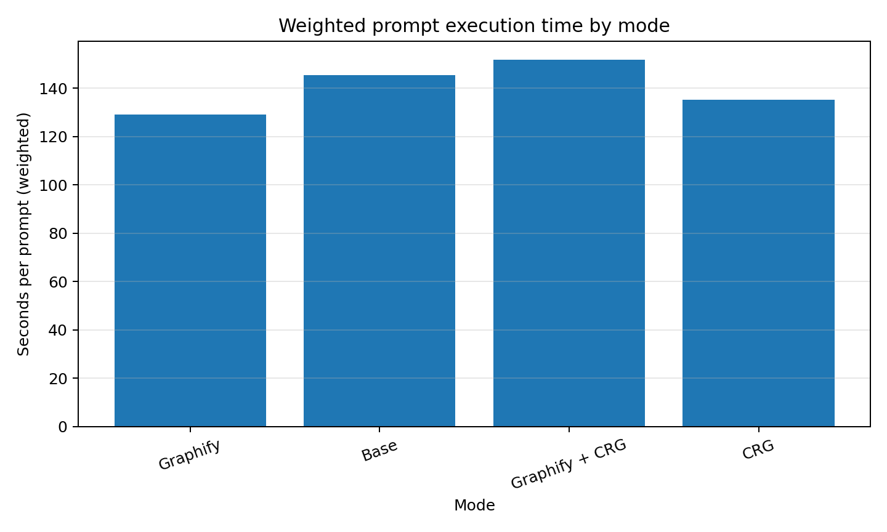
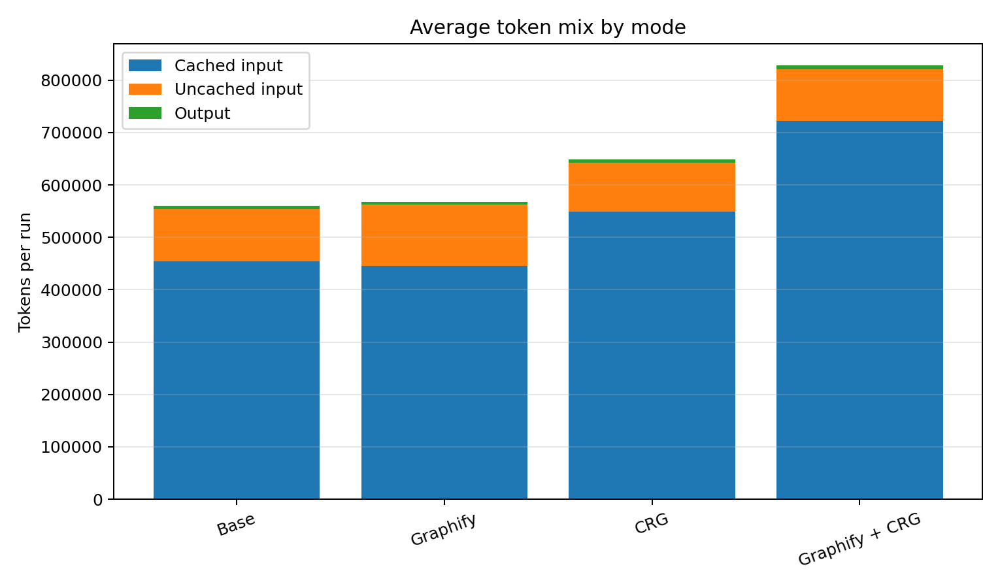
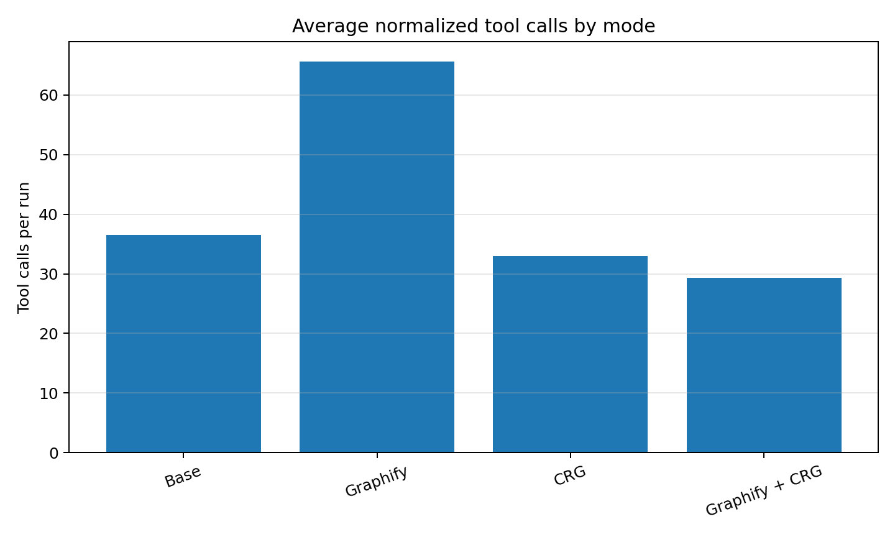

# LORQ Graphify / CRG comparison - final findings artifact

Date: 2026-06-25  
Authoring context: corrected full 6-case matrix, strict re-judging, and prompt-execution-time balanced recomputation.

## 1. Executive summary

This artifact consolidates the whole comparison of four LORQ modes across six nopCommerce code-understanding tasks:

- **Base**: normal agent run without Graphify or code-review-graph.
- **Graphify**: corrected default Graphify mode. This replaces the earlier mistaken `graphify-plus` run.
- **CRG**: out-of-box code-review-graph mode.
- **Graphify + CRG**: combined mode.

The final interpretation is based on three important corrections:

1. The comparison now uses **default Graphify**, not `graphify-plus`.
2. The content scores were **strictly re-judged** because the first rubric compressed almost every answer into the 90s.
3. The balanced score uses **prompt execution time only**, not graph setup time, because graph generation was repeated for sandboxing and would not normally happen before every prompt in steady-state use.

### Main conclusion

**Graphify is the best steady-state default mode in this corrected run.** It has the highest strict content score and the highest prompt-time balanced value score. Base remains a strong low-complexity fallback. CRG-only and Graphify+CRG are not justified as daily defaults in this benchmark.

The recommendation is:

| Scenario | Recommended mode | Why |
|---|---|---|
| Default steady-state workflow | Graphify | Best global strict quality/value, fastest weighted prompt execution time. |
| Low-complexity or no-index fallback | Base | Strong quality, cheaper than Graphify, no setup requirement. |
| Hard discovery / architecture escalation | Graphify + CRG, selectively | Wins `auth-discovery`, but is heavy and inconsistent elsewhere. |
| CRG-only daily default | Not recommended from this run | Lower strict quality than Base/Graphify and no clear out-of-box advantage. |

## 2. Final analysis contract

- Matrix: **6 cases x 4 modes = 24 runs**.
- Case weighting: **everyday cases = 70%**, hard graph-friendly cases = **30%**.
- Judging style: strict, presentation-grade qualitative scoring.
- Cost: model estimated price from run summaries.
- Time in balanced score: **agent/prompt execution time only**.
- Setup time: reported separately as cold-start or sandbox overhead.
- Deterministic validation: diagnostic only, not the quality score.

Strict scoring interpretation:

| Range | Meaning |
|---|---|
| 85-89 | Excellent / near presentation-ready. |
| 80-84 | Strong but with identifiable gaps. |
| 70-79 | Usable but needs review or rework. |
| 60-69 | Partial or weak for the task. |
| <60 | Not reliable. |

No run reached 90 under the strict rubric.

## 3. Global prompt-time value summary

| Mode           |   Strict content |   Cost USD |   Prompt time s |   Setup time s (separate) |   Balanced score |   Quality/min |
|:---------------|-----------------:|-----------:|----------------:|--------------------------:|-----------------:|--------------:|
| Graphify       |             82.8 |        1.0 |           129.1 |                      87.0 |             82.1 |          39.4 |
| Base           |             79.6 |        0.9 |           145.5 |                       0.0 |             77.7 |          33.7 |
| Graphify + CRG |             74.1 |        1.0 |           151.8 |                     108.7 |             70.0 |          29.8 |
| CRG            |             73.1 |        0.9 |           135.2 |                      24.8 |             69.1 |          33.1 |

Key readout:

- Graphify leads with **82.8 strict content** and **82.1 balanced score**.
- Base is second with **79.6 strict content** and **77.7 balanced score**.
- Graphify + CRG wins one hard case, but global value is pulled down by cost, prompt time, and weak everyday-case performance.
- CRG-only is the cheapest weighted mode, but its content quality is too low to be the default.

## 4. Per-case winners

| Case                     | Class               | Quality winner   |   Quality score | Value winner   |   Value score | Cost winner   |   Cost USD | Prompt speed winner   |   Prompt time s |
|:-------------------------|:--------------------|:-----------------|----------------:|:---------------|--------------:|:--------------|-----------:|:----------------------|----------------:|
| Admin permissions        | Everyday            | Graphify         |              84 | Graphify       |          83.7 | Base          |        0.9 | Graphify              |           128.9 |
| Admin product edit field | Everyday            | Graphify         |              83 | Graphify       |          82.5 | CRG           |        0.7 | CRG                   |           109.4 |
| Auth discovery           | Hard graph-friendly | Graphify + CRG   |              84 | Graphify + CRG |          82.9 | Base          |        0.8 | CRG                   |           114.7 |
| Cart to order flow       | Hard graph-friendly | Graphify         |              87 | Graphify       |          86.9 | Base          |        0.9 | Graphify              |           125.7 |
| Inactive customers CSV   | Everyday            | Graphify         |              83 | Graphify       |          82.7 | CRG           |        0.6 | Graphify              |           101.9 |
| Order total impact       | Hard graph-friendly | Base             |              84 | Base           |          83.5 | Graphify      |        0.9 | Graphify + CRG        |           157.3 |

Interpretation:

- Graphify wins the everyday cases: `admin-product-edit-field`, `admin-permissions`, and `inactive-customers-csv`.
- Graphify also wins `cart-to-order-flow`, which is a hard flow-tracing case.
- Base wins `order-total-impact` because its direct impact-analysis framing was strongest.
- Graphify + CRG wins `auth-discovery`, where broader graph/context expansion helped.

## 5. Strict content score matrix

| Case                     |   base |   crg |   graphify |   graphify+crg |
|:-------------------------|-------:|------:|-----------:|---------------:|
| admin-permissions        |     78 |    79 |         84 |             68 |
| admin-product-edit-field |     80 |    70 |         83 |             76 |
| auth-discovery           |     77 |    72 |         80 |             84 |
| cart-to-order-flow       |     82 |    66 |         87 |             74 |
| inactive-customers-csv   |     79 |    75 |         83 |             72 |
| order-total-impact       |     84 |    70 |         78 |             79 |

Main qualitative pattern:

- Graphify is best or tied-best on four of six cases.
- Base is consistently strong and wins `order-total-impact`.
- CRG-only is notably weak on `cart-to-order-flow`, despite that being graph-friendly.
- Graphify+CRG is strong only on `auth-discovery`; it underperforms on everyday cases.

## 6. Cost, token, and time findings

### 6.1 Model cost by mode

| Mode           |   Cost USD |   Prompt time s |   Setup time s (separate) |
|:---------------|-----------:|----------------:|--------------------------:|
| Graphify       |      0.981 |         129.086 |                    86.978 |
| Base           |      0.910 |         145.535 |                     0.000 |
| Graphify + CRG |      1.044 |         151.849 |                   108.733 |
| CRG            |      0.869 |         135.168 |                    24.775 |

### 6.2 Token and tool summary by mode

| Mode           |     Input |   Cached input |   Uncached input |   Output |   Reasoning output |   Total tokens |   Avg cost USD |   Prompt time s |   Setup time s |   Tool calls |   CRG calls |   Graphify calls |   Cache hit rate |   Answer words |
|:---------------|----------:|---------------:|-----------------:|---------:|-------------------:|---------------:|---------------:|----------------:|---------------:|-------------:|------------:|-----------------:|-----------------:|---------------:|
| Base           | 554389.50 |      453717.33 |        100672.17 |  6044.67 |            1218.83 |      560434.17 |           0.91 |          147.82 |           0.00 |        36.50 |        0.00 |             0.00 |             0.81 |         969.50 |
| CRG            | 643125.33 |      549120.00 |         94005.33 |  5425.17 |            1089.17 |      648550.50 |           0.91 |          137.54 |          24.75 |        33.00 |        4.33 |             0.00 |             0.85 |         884.17 |
| Graphify       | 562340.50 |      445653.33 |        116687.17 |  5414.50 |             455.33 |      567755.00 |           0.97 |          133.60 |          86.50 |        65.67 |        0.00 |            10.33 |             0.79 |         814.17 |
| Graphify + CRG | 821598.00 |      722986.67 |         98611.33 |  6386.33 |            1693.67 |      827984.33 |           1.05 |          157.59 |         108.74 |        29.33 |        0.33 |             6.67 |             0.88 |         905.00 |

### 6.3 The Graphify cost surprise

Graphify did **not** reduce model cost in this run. It improved quality, but the token profile shows it is not automatically a token saver.

Average per run:

| Mode | Input tokens | Cached input | Uncached input | Output tokens | Total tokens | Avg cost |
|---|---:|---:|---:|---:|---:|---:|
| Base | 554k | 454k | 101k | 6.0k | 560k | $0.91 |
| Graphify | 562k | 446k | 117k | 5.4k | 568k | $0.97 |
| CRG | 643k | 549k | 94k | 5.4k | 649k | $0.91 |
| Graphify + CRG | 822k | 723k | 99k | 6.4k | 828k | $1.05 |

The important point is that Graphify had **higher uncached input** than Base. That explains why cost did not drop even though output tokens were slightly lower. Graphify appears to improve navigation and answer quality, not necessarily reduce token usage.

Likely mechanism:

1. Graphify finds better candidate areas.
2. The agent still reads source files to verify the answer.
3. More tool turns and more source reads accumulate in context.
4. Quality improves, but priced input does not necessarily shrink.

Presentation phrasing:

> Graphify is a quality and prompt-latency improvement in this run, not a guaranteed token optimization.

## 7. Setup time versus prompt execution time

Setup time should not drive the steady-state user recommendation because this benchmark regenerated graph artifacts for sandbox isolation. In real usage, the graph/index would normally be reused across prompts.

Use this split:

| Time concept | Meaning | Use in final analysis |
|---|---|---|
| Prompt execution time | What the user feels once the mode is ready. | Used in the balanced score. |
| Setup time | Cold-start / graph build / sandbox overhead. | Reported separately as operational caveat. |

Weighted setup times reported separately:

- Base: **0.0s**
- CRG: **24.8s**
- Graphify: **87.0s**
- Graphify + CRG: **108.7s**

This means Graphify is best for **steady-state** use, but setup/index lifecycle remains important for CI, ephemeral agents, or benchmark sandboxes.

## 8. Tool usage findings

CRG tool-call matrix:

| Case                     |   base |   graphify |   crg |   graphify+crg |
|:-------------------------|-------:|-----------:|------:|---------------:|
| admin-product-edit-field |      0 |          0 |     6 |              0 |
| admin-permissions        |      0 |          0 |     2 |              2 |
| inactive-customers-csv   |      0 |          0 |     6 |              0 |
| auth-discovery           |      0 |          0 |     6 |              0 |
| order-total-impact       |      0 |          0 |     6 |              0 |
| cart-to-order-flow       |      0 |          0 |     0 |              0 |

Normalized tool-call matrix:

| Case                     |   base |   graphify |   crg |   graphify+crg |
|:-------------------------|-------:|-----------:|------:|---------------:|
| admin-product-edit-field |     28 |         58 |    38 |             26 |
| admin-permissions        |     26 |         70 |    34 |             28 |
| inactive-customers-csv   |     32 |         64 |    22 |             30 |
| auth-discovery           |     61 |         74 |    32 |             32 |
| order-total-impact       |     38 |         64 |    42 |             30 |
| cart-to-order-flow       |     34 |         64 |    30 |             30 |

Important observations:

- Graphify uses substantially more normalized tool calls than Base: about **65.7 vs 36.5** calls per run.
- Graphify+CRG barely used CRG MCP calls: only **2 total CRG calls** across the six combined-mode runs.
- CRG-only did not use CRG tools on `cart-to-order-flow` (**0 calls**), which weakens the evidence for CRG on the most flow-oriented case.
- Tool usage by itself is not quality. The final answer matters. But tool usage explains some cost and inconsistency.

## 9. Mode-by-mode interpretation

### Graphify

**Role:** best default steady-state workflow.

Strengths:

- Best global strict content score.
- Best prompt-time balanced score.
- Wins the three everyday cases and `cart-to-order-flow`.
- Produces strong implementation maps and codebase navigation guidance.
- Faster weighted prompt execution than Base in this run.

Weaknesses:

- Does not reduce model cost globally.
- More tool calls and more uncached input than expected.
- Can encourage broader exploration than necessary.

Best presentation claim:

> Graphify improves answer quality and steady-state prompt latency, but should not be sold as a token saver without additional prompt/tool-budget tuning.

### Base

**Role:** strong low-complexity fallback.

Strengths:

- No setup cost.
- Very strong content quality for plain code-navigation tasks.
- Best answer on `order-total-impact`.
- Cheaper than Graphify on weighted cost.

Weaknesses:

- Slightly weaker global strict quality.
- More prompt execution time than Graphify under steady-state scoring.
- Can be dense and broad, requiring more manual reading by the next developer.

Best presentation claim:

> Base remains the baseline to beat; Graphify wins, but not by enough to make Base obsolete.

### CRG-only

**Role:** not recommended as daily default from this run.

Strengths:

- Lowest weighted cost.
- Moderate setup time versus Graphify.
- Sometimes finds useful relationship context.

Weaknesses:

- Lower strict content than Base and Graphify.
- Does not show a clear out-of-box advantage.
- Weak on `cart-to-order-flow`, where graph tools should have helped.
- Tool usage was inconsistent.

Best presentation claim:

> Out-of-box CRG is not yet compelling as the default mode for this benchmark; it needs either better prompting, stronger task fit, or tool-use verification.

### Graphify + CRG

**Role:** selective hard-discovery escalation, not default.

Strengths:

- Wins `auth-discovery`.
- Can produce broader, well-grouped discovery maps.

Weaknesses:

- Highest weighted cost.
- Slowest weighted prompt execution.
- High setup overhead.
- Often does not use CRG MCP tools in combined mode.
- Worse than Graphify alone on everyday cases.

Best presentation claim:

> Combining Graphify and CRG is not additive by default. It may help hard discovery, but it is too heavy and inconsistent for daily use.

## 10. Case-by-case interpretation

### Admin product edit field

Winner: **Graphify**.

Why: Graphify gave the strongest implementation map for controller, model, factory, view, domain/persistence, validation, localization, and migration-related surfaces. Base was close, but Graphify had better file evidence and developer handoff. CRG was usable but thinner.

### Admin permissions

Winner: **Graphify**.

Why: Graphify gave the clearest permission-flow architecture, including authorization attributes, OR semantics, permission service/records, and registration flow. Base and CRG were usable, but less focused as implementation handoffs. Graphify+CRG was weaker and too generic.

### Inactive customers CSV

Winner: **Graphify**.

Why: Graphify best traced the everyday export path through controller, search model, factory/service/export manager, and inactivity semantics. Base was strong but longer and less crisp. CRG was cheaper, but content was less complete.

### Auth discovery

Winner: **Graphify + CRG**.

Why: Combined mode produced the strongest broad map across login, registration, password recovery, MFA, external auth, routes, views, and services. This is the main case where combined mode looked justified.

Caveat: It is still expensive/heavy, and the win should not be generalized to daily tasks.

### Order total impact

Winner: **Base**.

Why: Base produced the most directly useful impact-analysis answer: direct consumer table, contract/service/plugin/test surfaces, and useful prioritization. Graphify and Graphify+CRG were useful but denser and less clearly prioritized.

### Cart to order flow

Winner: **Graphify**.

Why: Graphify produced the best strict answer overall: clear sequence from add-to-cart through checkout/order creation, with strong ShoppingCartItem-to-OrderItem transition explanation. CRG-only was unexpectedly weak and did not demonstrate its expected graph advantage.

## 11. Deterministic validation caveat

The deterministic validator is useful as a diagnostic, but not a reliable quality score here. Several strong answers failed validation because the extractor failed to recognize shortened display paths or answer formatting. Human-quality judging should remain the primary content metric.

Recommended framing:

> Validation failures identify evidence-format risk, not necessarily answer-quality failure.

## 12. Final recommendation matrix

| Use-case class | Recommended mode | Backup mode | Avoid as default |
|---|---|---|---|
| Everyday feature localization | Graphify | Base | Graphify + CRG |
| Permissions/admin exploration | Graphify | Base or CRG | Graphify + CRG |
| Export/report path tracing | Graphify | Base | Graphify + CRG |
| Broad auth discovery | Graphify + CRG | Graphify | CRG-only |
| Contract impact analysis | Base | Graphify | CRG-only |
| Flow tracing | Graphify | Base | CRG-only |
| Global steady-state default | Graphify | Base | CRG-only / Graphify + CRG |

## 13. Presentation narrative

Suggested story for the final deck:

1. We evaluated four agent modes on six realistic nopCommerce codebase tasks.
2. We corrected the Graphify condition to use default Graphify, not Graphify-plus.
3. We re-judged content harshly because the first scores were too compressed.
4. We separated prompt execution time from graph setup time to match real-life steady-state use.
5. Graphify emerged as the best default: better strict quality and better steady-state prompt time.
6. Base remains a strong baseline and is still the right fallback when setup/indexing is unavailable.
7. CRG-only did not demonstrate enough quality advantage out-of-box.
8. Graphify+CRG helped one broad discovery task but is too heavy and inconsistent as a default.
9. Graphify improved quality, not token cost; future work should tune Graphify to reduce unnecessary reads.

## 14. Limitations

- One repetition per cell; results should be treated as directional, not statistically definitive.
- One target repo: nopCommerce.
- LLM judging is strict but still subjective.
- Tool usage depends on agent choices; a mode can be available but underused.
- Graph setup was repeated for sandboxing; real-life setup economics differ.
- Graphify token savings were not shown; further prompt/tool-budget experiments are needed.

## 15. Recommended follow-up experiments

1. **Repeat close or surprising cells**: especially Base vs Graphify on everyday cases.
2. **Graphify with source-read budget**: test whether Graphify can become a token saver.
3. **CRG forced/verified tool usage**: ensure graph tools are actually used on flow/impact tasks.
4. **Additional repositories**: validate whether Graphify’s advantage generalizes beyond nopCommerce.
5. **Multi-run variance**: run at least 3 repetitions for the key cells before making strong product claims.

## Appendix A - Strict notes by run

## admin-product-edit-field

### graphify — 83.0

Best strict answer for this case: complete and practical, but still not a near-perfect artifact because it is broad and caveats are implicit.

Strengths: Very complete MVC/admin-field map with good file evidence and supporting implementation path.

Weaknesses: Over-complete for the prompt; could be tighter and explicitly mark optional vs mandatory files.

### base — 80.0

Strong implementation map, but stricter grading penalizes breadth, shortened paths, and lack of crisp source-verified next-step sequencing.

Strengths: Covers controller/model/factory/view/domain/persistence path and gives usable implementation guidance.

Weaknesses: Too broad for candidate-path task; deterministic source path formatting issues; not enough separation between confirmed files and inferred follow-ups.

### graphify+crg — 76.0

Good but not efficient or crisp: it maps the area well, but strict grading penalizes over-breadth and some plausible-but-not-proven migration/version guidance.

Strengths: Broad end-to-end coverage with controller/model/factory/view/persistence guidance.

Weaknesses: Too exhaustive; some guidance reads inferred rather than source-demonstrated; not better than Graphify alone.

### crg — 70.0

Usable but clearly weaker than base/Graphify under stricter grading: it covers the main path, but with thinner implementation specificity.

Strengths: Finds required files and most adjacent components.

Weaknesses: Less concrete on existing field examples, UI binding, and exact implementation sequence; weaker developer handoff.

## admin-permissions

### graphify — 84.0

Strongest strict answer for permissions: clear architecture and permission-flow evidence, though still not flawless as a step-by-step change guide.

Strengths: Excellent coverage of authorization attributes, OR semantics, permission service/records, and registration flow.

Weaknesses: Less explicit on admin UI management and concrete add-new-permission checklist.

### crg — 79.0

Very usable but not presentation-perfect: broad structural coverage, but less crisp as a workflow handoff.

Strengths: Broad permission structure, plugin/admin notes, authorization behavior, service details.

Weaknesses: Verbose; weaker concrete “do this next” guidance; risks overwhelming a daily-workflow user.

### base — 78.0

Solid answer, but stricter grading lowers it because it is explanatory rather than a concise implementation-ready path.

Strengths: Explains admin authorization layers and key permission components.

Weaknesses: Could better prioritize exact files/actions for adding/checking a permission; somewhat verbose.

### graphify+crg — 68.0

Acceptable but noticeably behind: main layers are present, but it lacks enough concrete examples and implementation guidance for a high score.

Strengths: Covers attributes, service, records, startup, and management areas.

Weaknesses: Too generic in places; less evidence and less actionable than other modes.

## inactive-customers-csv

### graphify — 83.0

Best strict answer: gives a strong everyday export implementation path with useful nuance, but still leaves a few UI/localization details underdeveloped.

Strengths: Clear path through controller, search model, factory/service/export manager; good inactive-definition discussion.

Weaknesses: Could be more explicit on button placement/localization and exact CSV formatter reuse.

### base — 79.0

Strong and usable, but strict scoring penalizes length and incomplete UI/localization specificity.

Strengths: Good controller/search model/service/export path; useful inactivity semantics.

Weaknesses: Long; should more clearly distinguish query/filter/export/UI changes and exact CSV precedent.

### crg — 75.0

Usable but not as strong as base/Graphify: good semantics, thinner controller/UI details.

Strengths: Good inactivity semantics and service/export coverage.

Weaknesses: Less complete on UI binding, controller action details, and implementation sequence.

### graphify+crg — 72.0

Usable concise map, but strict grading penalizes thinner source evidence and less complete action detail.

Strengths: Good integration-point table and service/export/resource mentions.

Weaknesses: Less exhaustive evidence; less concrete about existing export action and where exactly to add UI.

## auth-discovery

### graphify+crg — 84.0

Best strict answer for auth: complete and well grouped, though still long and with some broad/glob references.

Strengths: Strong workflow grouping across controller/service/MFA/external auth/routes/views.

Weaknesses: Long; a few view references are broad rather than exact; not all uncertainty is explicit.

### graphify — 80.0

Strong auth discovery answer with broad coverage and better completeness, but still a large map rather than a concise workflow-level synthesis.

Strengths: Covers primary auth flows, external auth, MFA, services, models, routes/views.

Weaknesses: Large and somewhat undifferentiated; caveats and source-confirmed vs inferred boundaries could be clearer.

### base — 77.0

Good broad auth map, but strict scoring penalizes candidate-map format and limited workflow narrative/uncertainty separation.

Strengths: Covers login, registration, password recovery, MFA, external auth and important files.

Weaknesses: More of a file inventory than a verified flow map; long and not sharply prioritized.

### crg — 72.0

Usable source-verified map, but under strict grading it is less precise and more directory-level than the leaders.

Strengths: Includes core controller/service and several auth-related areas.

Weaknesses: Some references are broad or directory-level; less polished organization and lower precision.

## order-total-impact

### base — 84.0

Best strict answer for impact: comprehensive and directly useful, though length keeps it below exceptional.

Strengths: Direct consumer table, contract/implementation/service/plugin/test surface, useful prioritization.

Weaknesses: Long and dense; some shortened display paths; could separate highest-risk changes more sharply.

### graphify+crg — 79.0

Strong broad map but not clearly better than base; strict grading penalizes length and unnecessary tool/method note.

Strengths: Good contract/order-processing/checkout/payment/discount/tax/test coverage.

Weaknesses: Long; Graphify note is irrelevant; not clearly more actionable than base.

### graphify — 78.0

Good impact map, but strict scoring penalizes density, weaker prioritization, and limited caveats.

Strengths: Covers contract, DI, order processing, checkout/payment/discount/tax/plugins/tests.

Weaknesses: Dense affected-surface list; not as risk-prioritized as base; limited caveats.

### crg — 70.0

Usable but not strong enough: relationship evidence is useful, but prioritization and direct-consumer framing lag behind.

Strengths: Good relationship-style coverage of checkout/payment/plugins/tax/discount/tests.

Weaknesses: Verbose; less structured; misses useful direct-consumer framing and priority ranking.

## cart-to-order-flow

### graphify — 87.0

Best strict answer overall: clear source-backed cart-to-order sequence, excellent transition point, still not perfect because caveats are limited.

Strengths: Clear sequence from add-to-cart through checkout/order creation; strong ShoppingCartItem-to-OrderItem conversion explanation.

Weaknesses: Could add more explicit uncertainty/caveat notes and distinguish core vs side-effect paths.

### base — 82.0

Strong flow trace with detailed source evidence, but strict grading penalizes density and lack of concise executive sequence.

Strengths: Detailed chain from route/controller to cart service, checkout, PlaceOrderAsync, post-processing and cleanup.

Weaknesses: Long and dense; could better isolate the minimal flow from supporting detail.

### graphify+crg — 74.0

Solid but not top-tier: covers the required flow, but lacks richness and precision compared with base/Graphify.

Strengths: Good high-level sequence through add-to-cart, checkout, PlaceOrderAsync, SaveOrderDetailsAsync, cleanup.

Weaknesses: Less detail on routes, payment request, post-processing, events, persistence; not enough evidence of combined-tool value.

### crg — 66.0

Weakest strict flow answer: it is usable, but the CRG advantage did not materialize and the answer itself is less complete.

Strengths: Covers main required files and broad flow stages.

Weaknesses: Less route/post-processing/persistence detail; final note about graph MCP cancellation undermines the run; weaker evidence depth.

